# HƯỚNG DẪN CÀI ĐẶT VÀ SỬ DỤNG PLC CODE

### *Dự án: Hệ thống phân loại muỗi tự động trong hệ thống LoadingSystem*

# MỤC LỤC TÀI LIỆU THIẾT KẾ

- **[CHƯƠNG 1: CHUẨN BỊ MÔI TRƯỜNG VÀ YÊU CẦU TỐI THIỂU HỆ THỐNG](#chuong-1)**
  - [1.1. DANH SÁCH THIẾT BỊ PHẦN CỨNG](#sec-1-1)
  - [1.2. YÊU CẦU CẤU HÌNH LAPTOP](#sec-1-2)
  - [1.3. YÊU CẦU PHẦN MỀM](#sec-1-3)
  - [1.4. KIỂM TRA CỔNG COM CỦA CÁP RS485 TRÊN DEVICE MANAGER](#sec-1-4)
- **[CHƯƠNG 2: THIẾT LẬP CẤU TRÚC THƯ MỤC DỰ ÁN](#chuong-2)**
  - [2.1. HƯỚNG DẪN CÁC BƯỚC CLONE DỰ ÁN BẰNG TORTOISE GIT](#sec-2-1)
  - [2.2. KIỂM TRA VÀ XÁC NHẬN CẤU TRÚC THƯ MỤC MÃ NGUỒN](#sec-2-2)
- **[CHƯƠNG 3: CẤU HÌNH VÀ KHỞI CHẠY HỆ THỐNG](#chuong-3)**
  - [3.1. CẤU HÌNH VÀ KHỞI CHẠY RUST BACKEND DAEMON BẰNG CMD/TERMINAL](#sec-3-1)
  - [3.2. CÀI ĐẶT VÀ KHỞI CHẠY GIAO DIỆN PYTHON HMI 3D](#sec-3-2)
- **[CHƯƠNG 4: HƯỚNG DẪN THAO TÁC VÀ ĐIỀU KHIỂN GIAO DIỆN HMI](#chuong-4)**
  - [4.1. CÁC PHÂN HỆ MÔ PHỎNG TRÊN GIAO DIỆN HMI 3D SCADA](#sec-4-1)
  - [4.2. CÁC BƯỚC CẤU HÌNH THÔNG SỐ VẬT LÝ VÀ THUẬT TOÁN ĐIỀU TỐC](#sec-4-2)
  - [4.3. CÁC BƯỚC VẬN HÀNH THẢ MUỖI TỰ ĐỘNG 12 LOÀI VÀ ĐIỀU KHIỂN MÂM XOAY](#sec-4-3)
  - [4.4. HUỚNG DẪN CAN THIỆP THỦ CÔNG VÀ TỰ HỌC BÙ SAI SỐ](#sec-4-4)

# <a id="chuong-1"></a>CHƯƠNG 1: CHUẨN BỊ MÔI TRƯỜNG VÀ YÊU CẦU TỐI THIỂU HỆ THỐNG

## <a id="sec-1-1"></a>1.1. DANH SÁCH THIẾT BỊ PHẦN CỨNG

### 1.1.1. Danh sách thiết bị

- **1.** Bộ điều khiển PLC Delta DVP-14SS2 hoặc PLC DVP-28SS2 cấp nguồn 24VDC.


<p align="center">
  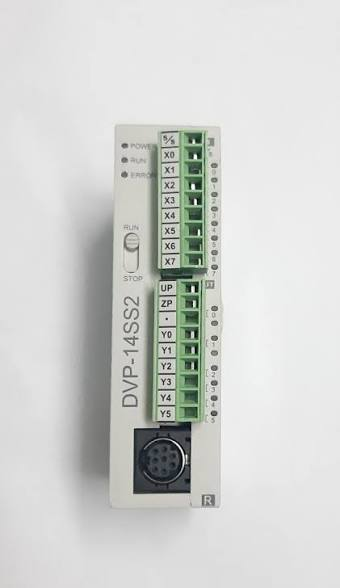
</p>


<p align="center">
  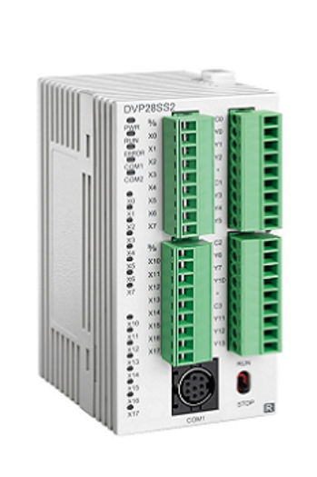
</p>

- **2.** Bộ điều khiển Servo Driver RS Automation CSD7 + động cơ Servo Motor CSMT-02BR1ABT3.


<p align="center">
  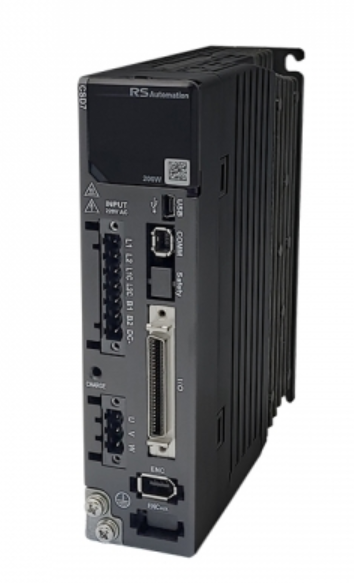
</p>


<p align="center">
  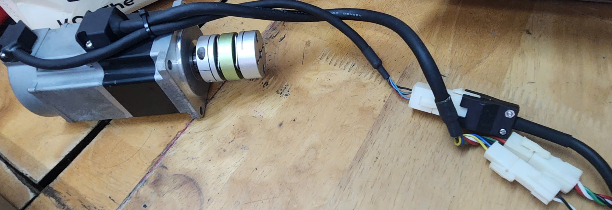
</p>

- **3.** Nguồn tổ ong 24 VDC.


<p align="center">
  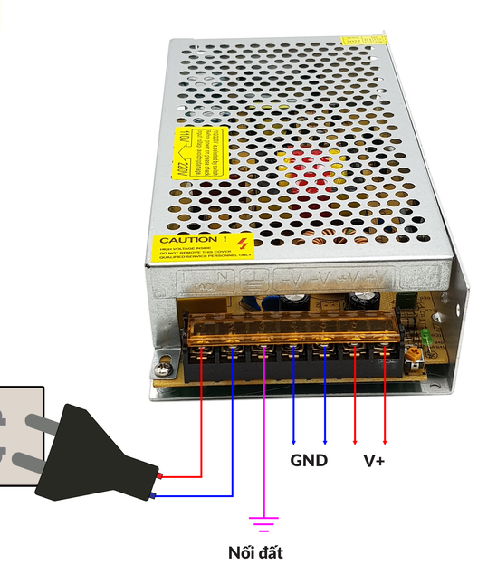
</p>

- **4.** Cáp chuyển đổi USB-to-RS485 kết nối cổng USB Laptop với cổng COM2 RS-485 trên PLC Delta.


<p align="center">
  
</p>

- **5.** Cáp nạp chuẩn USB-to-RS232.

### 1.1.2. Hình ảnh tổng quan phần cứng

Toàn bộ thiết bị được đấu nối nguồn 24VDC, cáp tín hiệu điều khiển xung/chiều và cáp truyền thông RS485.


<p align="center">
  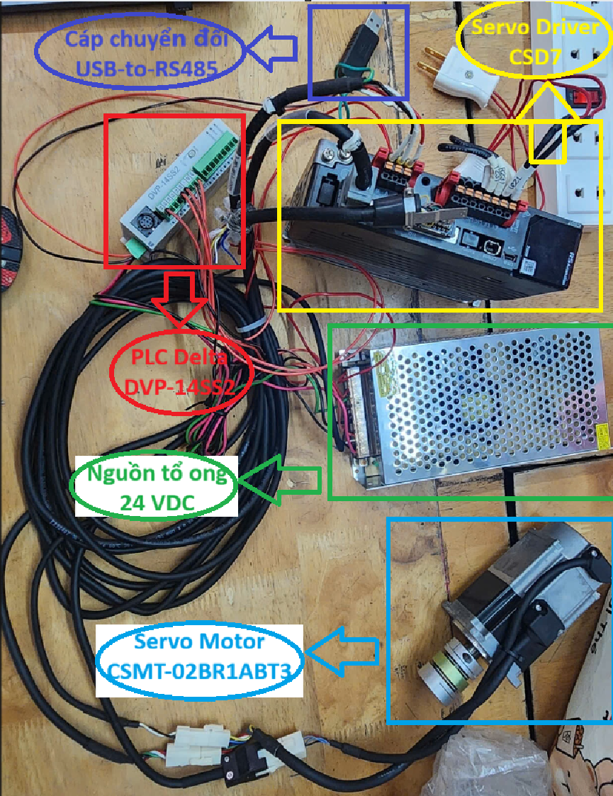
</p>

<p align="center"><em>Hình 1.1: Sơ đồ thiết bị phần cứng đã được đấu nối</em></p>

## <a id="sec-1-2"></a>1.2. YÊU CẦU CẤU HÌNH LAPTOP

### 1.2.1. Yêu cầu tối thiểu

- **Hệ điều hành:** Windows 10 / Windows 11 (64-bit).

- **Bộ nhớ RAM:** Tối thiểu 4 GB.

- **Cổng kết nối:** Tối thiểu 1 cổng USB Type-A hoạt động tốt (1 cổng cắm cáp RS485 truyền thông).

### 1.2.2. Các bước kiểm tra

- **Bước 1:** Nhấn tổ hợp phím Windows + I hoặc Search trên taskbar → “Settings” để mở Settings. Sau đó, chọn System → About để xem cấu hình laptop.

- **Bước 2:** Quan sát các thông số tại mục Device info và đảm bảo các mục:

  - **System type:** Phải là 64-bit operating system, x64-based processor.

  - **Installed RAM:** Tối thiểu 4.00 GB.


<p align="center">
  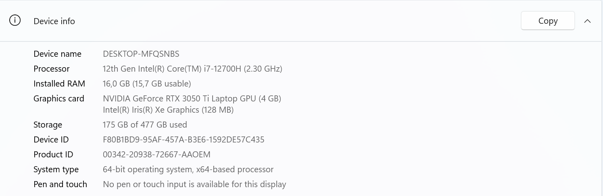
</p>

<p align="center"><em>Hình 1.2: Kiểm tra cấu hình của laptop</em></p>

## <a id="sec-1-3"></a>1.3. YÊU CẦU PHẦN MỀM

### 1.3.1. Danh sách phần mềm bắt buộc

- **Rust toolchain (>= 1.70.0):** Dùng để biên dịch và chạy Rust Backend Daemon.

- **Python (>= 3.10):** Dùng để khởi chạy giao diện điều khiển HMI 3D SCADA (customtkinter).

- **WPLSoft (Delta Electronics):** Phần mềm nạp file chương trình PLC Delta (.il / .st).

- **Driver USB-to-Serial:** Driver chip truyền thông để Windows nhận diện cáp RS485 và cáp nạp PLC.

### 1.3.2. Các bước kiểm tra phần mềm trên Laptop

- **Bước 1:** Mở cửa sổ Command Prompt hoặc PowerShell.

- **Bước 2:** Nhập các lệnh sau để kiểm tra:

```bash
rustc --version
python --version
```

- **Bước 3:** Kết quả hiển thị phiên bản Rust và Python tương ứng.


<p align="center">
  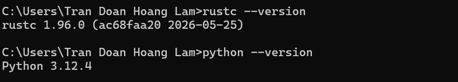
</p>

<p align="center"><em>Hình 1.3: Chạy lệnh kiểm tra phiên bản Rust và Python</em></p>

## <a id="sec-1-4"></a>1.4. KIỂM TRA CỔNG COM CỦA CÁP RS485 TRÊN DEVICE MANAGER

### 1.4.1. Mục đích

Xác nhận Windows nhận diện cáp USB-to-RS485 và xác định chính xác số thứ tự cổng COMx (ví dụ: COM3) để cấu hình file mã nguồn.

### 1.4.2. Các bước thực hiện kiểm tra

- **Bước 1:** Cắm đầu USB của cáp USB-to-RS485 vào cổng USB trên Laptop.

- **Bước 2:** Nhấn tổ hợp phím Windows + X → Chọn Device Manager (hoặc nhấn Search trên taskbar và gõ “Device Manager”).

- **Bước 3:** Tìm và nhấn vào **Ports (COM & LPT)**. Trường hợp không thấy nhánh **Ports (COM & LPT)** thì đợi vài giây để laptop nhận dạng cổng COM này hoặc rút cáp USB-to-RS485 ra cắm lại.

- **Bước 4:** Kiểm tra cổng COM laptop.


<p align="center">
  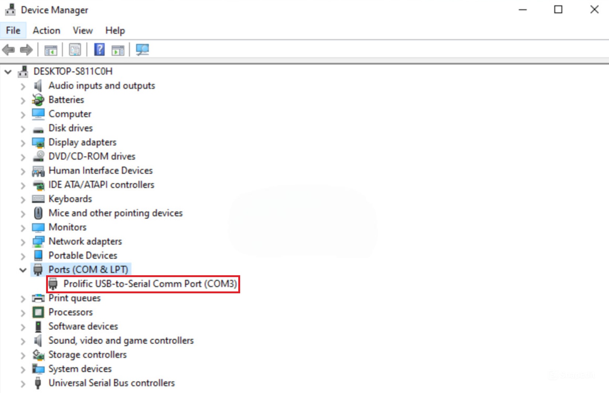
</p>

<p align="center"><em>Hình 1.4: Cửa sổ Device Manager kiểm tra cổng COM</em></p>

# <a id="chuong-2"></a>CHƯƠNG 2: THIẾT LẬP CẤU TRÚC THƯ MỤC DỰ ÁN

## <a id="sec-2-1"></a>2.1. HƯỚNG DẪN CÁC BƯỚC CLONE DỰ ÁN BẰNG TORTOISE GIT

- **Bước 1:** Mở ứng dụng File Explorer và truy cập đến đường dẫn thư mục Project/git.mksol.com/mks/myworkspace/loading-system. (Nếu chưa có thư mục, nhấp chuột phải chọn New → Folder để tạo mới đường dẫn).

- **Bước 2:** Nhấp chuột phải vào vùng trống bên trong thư mục loading-system → Chọn **TortoiseGit** →  **Clone**...

- **Bước 3:** Tại hộp thoại cửa sổ Git clone - TortoiseGit, nhập các nội dung sau:

  - **URL:** https://git.mksol.vn/mks/myworkspace/loading-system/plc-code

  - **Directory:** Project/mks/myworkspace/loading-system/plc-code

  - **Branch:** Chọn ô Branch và nhập nhánh: develop


<p align="center">
  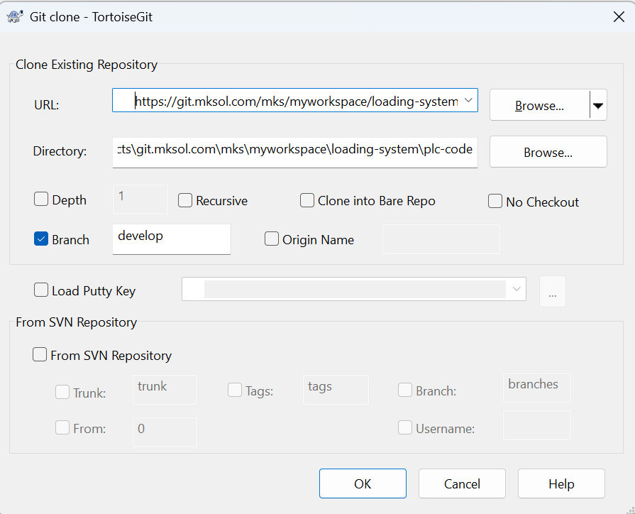
</p>

<p align="center"><em>Hình 2.1: Git clone – TortoiseGit clone project plc-code về laptop</em></p>

- **Bước 4.** Bấm nút OK. Cửa sổ tiến trình TortoiseGit sẽ tự động tải bộ mã nguồn về máy. Khi hoàn tất hiển thị thông báo Success, bấm nút Close để kết thúc.


<p align="center">
  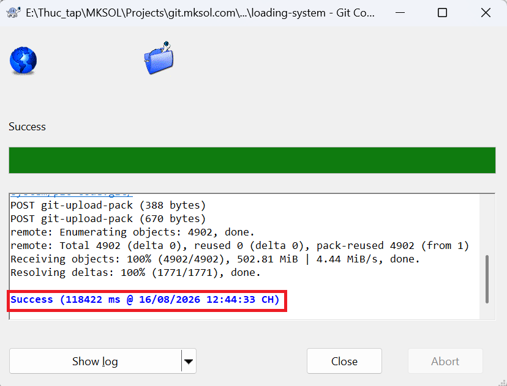
</p>

<p align="center"><em>Hình 2.2: Clone nhánh “develop” về máy thành công</em></p>

## <a id="sec-2-2"></a>2.2. KIỂM TRA VÀ XÁC NHẬN CẤU TRÚC THƯ MỤC MÃ NGUỒN

Sau khi clone thành công, mở thư mục plc-code trong File Explorer. Cấu trúc cây thư mục phải đảm bảo đầy đủ các thư mục và tệp tin sau:

| Thư mục / Tệp tin | Mục đích và chức năng trong hệ thống |
| --- | --- |
| plc_firmware/ | Chứa mã nguồn PLC Delta (standalone_test.il cho level 1 và dynamic_mode.il cho level 2-5). |
| rust_backend/ | Mã nguồn layer 2 - Async Daemon Server (Rust Tokio Engine, trích xuất gói JSON IPC và truyền Modbus RTU). |
| python_hmi/ | Mã nguồn layer 3 - Giao diện 3D SCADA (main.py, visualizer 3D, control panel, log console). |
| docs/ | Thư mục chứa tài liệu đặc tả kiến trúc (BUILD.md, USAGE.md, code_architecture_guide.md). |
| tests/ | Thư mục chứa các kịch bản kiểm thử tự động (Unit test, Integration test). |
| README.md | Tệp tài liệu tổng quan giới thiệu phiên bản, kiến trúc 3 tầng và hướng dẫn chạy nhanh. |
| kientruc.md | Tệp mô tả chi tiết kiến trúc kết nối và bản đồ địa chỉ thanh ghi Modbus PLC. |


<p align="center">
  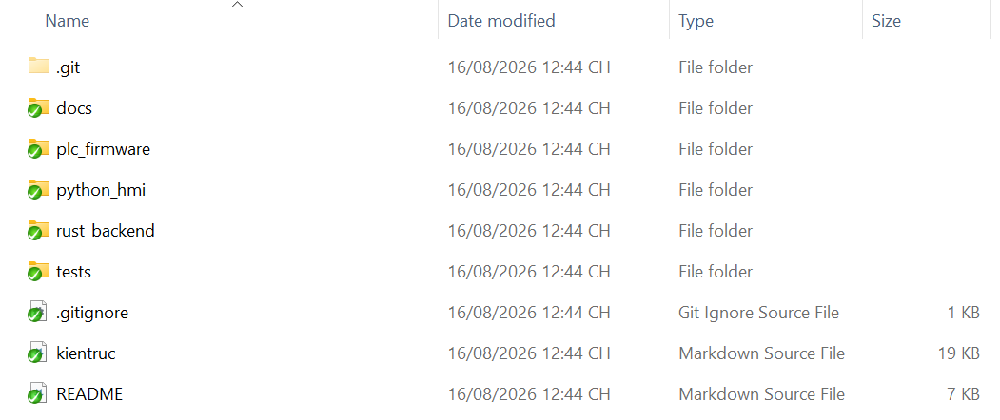
</p>

<p align="center"><em>Hình 2.3: Cấu trúc cây thư mục dự án plc-code</em></p>

# <a id="chuong-3"></a>CHƯƠNG 3: CẤU HÌNH VÀ KHỞI CHẠY HỆ THỐNG

## <a id="sec-3-1"></a>3.1. CẤU HÌNH VÀ KHỞI CHẠY RUST BACKEND DAEMON BẰNG CMD/TERMINAL

### 3.1.1. Cấu hình file config.toml

Mở tệp rust_backend/config.toml và chỉnh sửa thông số cổng COM hiển thị chính xác trong Device Manager.

```toml
[serial]
port = "COM3"        # Thay thế MOCK bằng cổng COM thực tế
baud_rate = 9600
data_bits = 8
stop_bits = 1
parity = "even"
```

### 3.1.2. Khởi chạy Rust Backend Daemon

Mở Terminal / CMD tại thư mục rust_backend và chạy lệnh:

```bash
cargo run
```

### 3.1.3. Kết quả kỳ vọng

Terminal hiển thị thông báo log:

```text
INFO loading_daemon: === LoadingSystem Backend Daemon ===
INFO loading_system::api::ipc_server: IPC server listening on 127.0.0.1:5555
```

kèm thông báo kết nối Modbus RTU thành công tới PLC Delta qua cổng COM3.


<p align="center">
  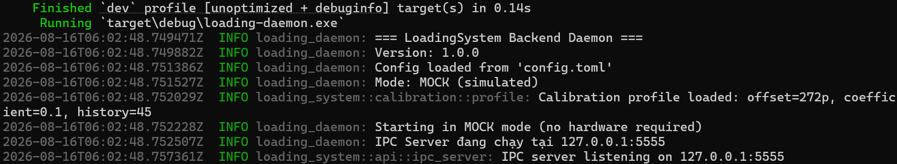
</p>

<p align="center"><em>Hình 3.1: Chạy lệnh cargo run trong thư mục rust_backend</em></p>

→ Đây là kết quả khi chạy giả lập và không cần thiết bị phần cứng.

## <a id="sec-3-2"></a>3.2. CÀI ĐẶT VÀ KHỞI CHẠY GIAO DIỆN PYTHON HMI 3D

### 3.2.1. Khởi chạy ứng dụng HMI GUI 3D

Chạy lệnh khởi động giao diện chính trong thư mục python_hmi:

```bash
python main.py
```

### 3.2.3. Kết quả kỳ vọng và kiểm tra kết nối

Ứng dụng HMI 3D SCADA khởi chạy thành công. Kiểm tra thanh trạng thái ở góc trên bên phải màn hình HMI hiển thị chấm xanh: **● Đã kết nối**


<p align="center">
  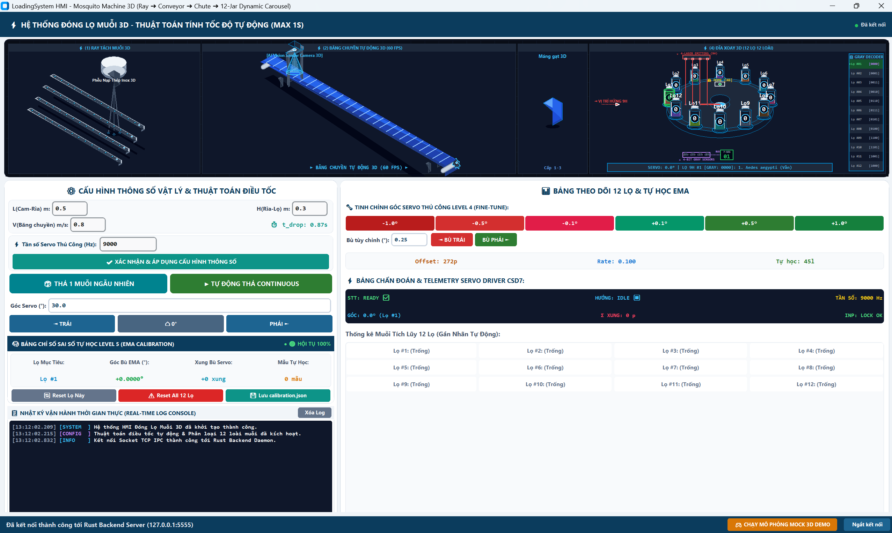
</p>

<p align="center"><em>Hình 3.2: Cửa sổ HMI 3D SCADA khởi chạy thành công</em></p>

# <a id="chuong-4"></a>CHƯƠNG 4: HƯỚNG DẪN THAO TÁC VÀ ĐIỀU KHIỂN GIAO DIỆN HMI

## <a id="sec-4-1"></a>4.1. CÁC PHÂN HỆ MÔ PHỎNG TRÊN GIAO DIỆN HMI 3D SCADA

Giao diện HMI 3D SCADA bao gồm 4 phân hệ mô phỏng 3D thời gian thực trên màn hình:

- **1.** Ray tách muỗi 3D

- **2.** Băng chuyền tự động 3D (60 FPS, vị trí Camera AI Vision ở đầu băng chuyền)

- **3.** Máng gạt 3D

- **4.** Đĩa xoay định vị 3D (12 lọ tương ứng 12 loài muỗi).


<p align="center">
  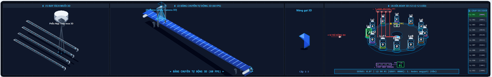
</p>

<p align="center"><em>Hình 4.1: 4 phân hệ mô phỏng 3D thời gian thực</em></p>

## <a id="sec-4-2"></a>4.2. CÁC BƯỚC CẤU HÌNH THÔNG SỐ VẬT LÝ VÀ THUẬT TOÁN ĐIỀU TỐC

- **Bước 1.** Nhập các thông số vật lý hệ thống tại khung **CẤU HÌNH THÔNG SỐ VẬT LÝ & THUẬT TOÁN ĐIỀU TỐC**:

  - **L(Cam-Rìa) m:** Khoảng cách từ camera AI tới rìa băng chuyền (Mặc định 0.5m).

  - **H(Rìa-Lọ) m:** Độ cao từ rìa băng chuyền xuống miệng lọ (Mặc định 0.3m).

  - **V(Băng chuyền) m/s:** Tốc độ di chuyển của băng chuyền (Mặc định 0.8 m/s).

  - **Tần số Servo Thủ Công (Hz):** Tần số phát xung thủ công (Mặc định 9000 Hz).

- **Bước 2.** Bấm nút **[✔ XÁC NHẬN & ÁP DỤNG CẤU HÌNH THỐNG SỐ]** để lưu tham số và tự động tính toán thời gian rơi vật lý t_drop (Mặc định 0.87s).


<p align="center">
  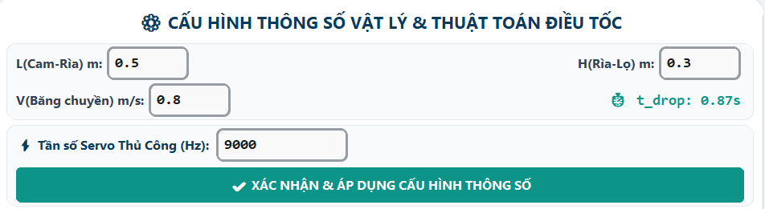
</p>

<p align="center"><em>Hình 4.2: Nhập thông số vật lý và xác nhận áp dụng trên HMI</em></p>

## <a id="sec-4-3"></a>4.3. CÁC BƯỚC VẬN HÀNH THẢ MUỖI TỰ ĐỘNG 12 LOÀI VÀ ĐIỀU KHIỂN MÂM XOAY

**Chế độ thả 1 muỗi ngẫu nhiên:**

- **1.** Nhấn nút **[🎲 THẢ 1 MUỖI NGẪU NHIÊN]**.

- **2.** Hệ thống tự động sinh 1 loài muỗi, tính góc quay Δθ, tần số f (Hz) và tự động quay đĩa về đúng vị trí lọ hứng tương ứng.

**Chế độ vận hành tự động liên tục:**

  - Nhấn nút **[▶ TỰ ĐỘNG THẢ CONTINUOUS]** để hệ thống lặp lại quy trình phân loại tự động liên tục.

- **2.** Hệ thống tự động sinh 1 loài muỗi mỗi khoảng thời gian t (s), tính góc quay Δθ, tần số f (Hz) và tự động quay đĩa về đúng vị trí lọ hứng tương ứng.

- **3.** Nhấn nút một lần nữa để dừng vòng lặp.

**Điều khiển góc mâm xoay thủ công:**

- **1.** Nhập góc quay mơ ước (Ví dụ 30.0°).

- **2.** Nhấn các nút TRÁI, 0°, PHẢI để kiểm tra vị trí quay mâm xoay.


<p align="center">
  
</p>

<p align="center"><em>Hình 4.3: Thao tác thả muỗi tự động và điều khiển mâm xoay</em></p>

## <a id="sec-4-4"></a>4.4. HUỚNG DẪN CAN THIỆP THỦ CÔNG VÀ TỰ HỌC BÙ SAI SỐ

**Thao tác can thiệp thủ công (Level 4):**

  - Nhấn các nút gia giảm góc nhanh: -1.0°, -0.5°, -0.1°, +0.1°, +0.5°, +1.0° hoặc nhập độ lệch và bấm BÙ TRÁI / BÙ PHẢI để điều chỉnh vị trí mâm xoay khi có sai số cơ khí.


<p align="center">
  
</p>

<p align="center"><em>Hình 4.4: Điều chỉnh thủ công khi có sai số cơ khí</em></p>

**Lưu sai số hiệu chuẩn (Level 5):**

  - Nhấn nút **[Lưu calibration.json]** để thuật toán EMA cập nhật sai số bù vĩnh viễn vào tệp dữ liệu.

**Khôi phục hiệu chuẩn:**

  - Nhấn nút **Reset Lọ Này** hoặc **Reset All 12 Lọ** để đưa chỉ số bù về góc 0.0°.


<p align="center">
  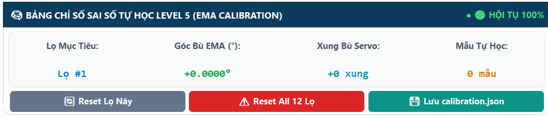
</p>

<p align="center"><em>Hình 4.5: Lưu cập nhật sai số và khôi phục hiệu chuẩn</em></p>
